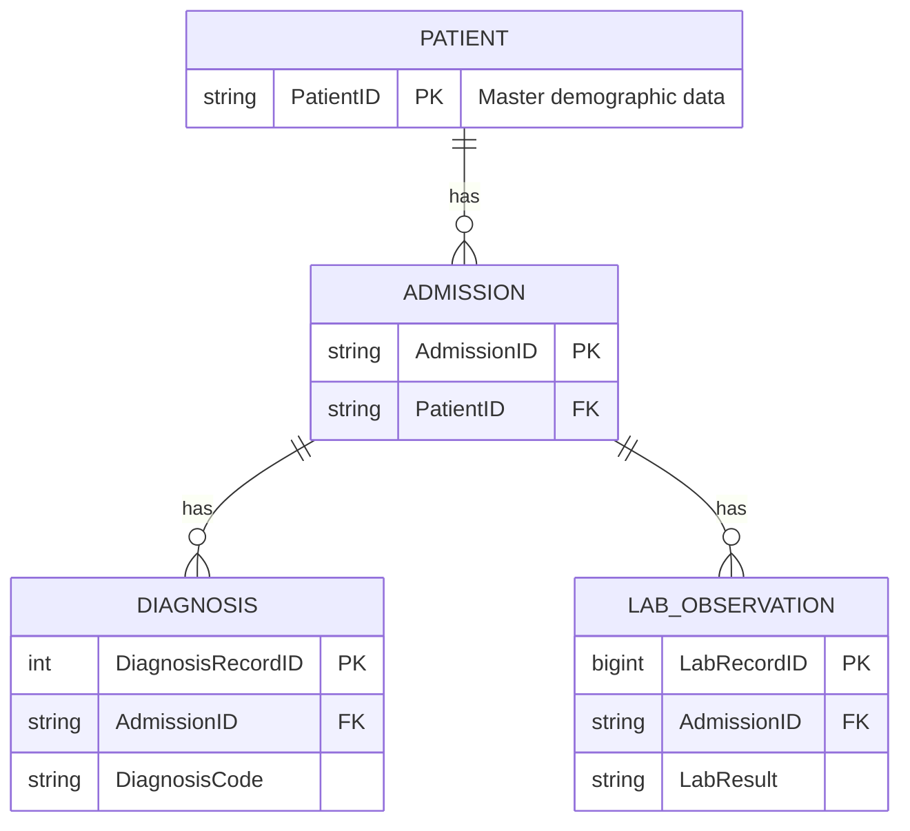

# ITEC5020_MYSQL_Week8_Capella

**My Masters Project at Capella**
**ITEC 5020 Final Project: Hypotify Clinical Insights Bot Database**

## 🌟 Project Overview

This repository contains the complete relational database infrastructure and data required for the **Hypotify Clinical Insights Bot**. This AI virtual assistant project, centered in the Healthcare domain, uses a structured EMR dataset to enable researchers to query patient data using Natural Language Processing (NLP) and run predictive Machine Learning (ML) models.

**Status**: The database (`artificial_emr`) is fully built, normalized to Third Normal Form (3NF), and populated with the final 500-patient synthetic EMR dataset. This repository serves as the definitive starting point for ITEC 5025.

## 💾 Database Architecture (MySQL)

The database schema is designed for maximum integrity and query performance, which is vital for feeding reliable data to the AI models.

### Final Schema Tables

| Table | Primary Key (PK) | Foreign Key (FK) | Data Role |
| :--- | :--- | :--- | :--- |
| **PATIENT** | `PatientID` | *None* | Master demographic data (Parent) |
| **ADMISSION** | `AdmissionID` | `PatientID` | Clinical encounter records |
| **DIAGNOSIS** | `DiagnosisRecordID` (Surrogate) | `AdmissionID` | Specific diagnosis codes (ICD-10) |
| **LAB_OBSERVATION** | `LabRecordID` (BIGINT) | `AdmissionID` | High-volume time-series data (Lab Results) |

### Entity Relationship Diagram

## 📦 Repository Contents

This repository includes the complete final deliverables for the database phase.

| File Name | Type | Description |
| :--- | :--- | :--- |
| `ITEC5020_Final_Schema_and_Tests.sql` | SQL Script | The core executable script. It creates the entire `artificial_emr` database schema, includes `LOAD DATA INFILE` commands for population, and runs the final Integrity and Performance tests. |
| `PatientCorePopulatedTable.csv` | Data Set | Final 500-patient demographic records. |
| `AdmissionsCorePopulatedTable.csv` | Data Set | Final 500-patient admissions records. |
| `AdmissionsDiagnosesCorePopulatedTable.csv` | Data Set | Final diagnosis records for all admissions. |
| `LabsCorePopulatedTable.csv` | Data Set | Final high-volume lab observation records. |
| `Week8_Reflection_Paper.pdf` | Documentation | Written reflection on data preprocessing, import challenges (Date/Time formatting), and validation of the final database design. |

## 🚀 Getting Started

### Prerequisites
*   **MySQL Server**: Ensure you have MySQL installed and running.
*   **MySQL Workbench** (Optional): For easy script execution and visualization.

### Usage
1.  Clone this repository.
2.  Open `ITEC5020_Final_Schema_and_Tests.sql` in your MySQL client.
3.  Adjust the file paths in the `LOAD DATA INFILE` statements to match your local directory structure if necessary.
4.  Run the script to build the database, import data, and run tests.

## 🚀 AI Integration & Validation

The successful final data import confirms the following:

*   **Data Integrity**: Foreign Key constraints successfully blocked any orphaned records during the mass import, validating the integrity required for ML model training.
*   **Performance**: Multi-table join queries (required by the NLP engine) run efficiently, proving the 3NF design is optimized for large-scale analysis.
*   **Ethical Foundation**: The entire system relies on synthetic EMR data, eliminating privacy risks (HIPAA/PII) for the ITEC 5025 development phase.

---
*This repository is ready to move into the application development stage in ITEC 5025.*
